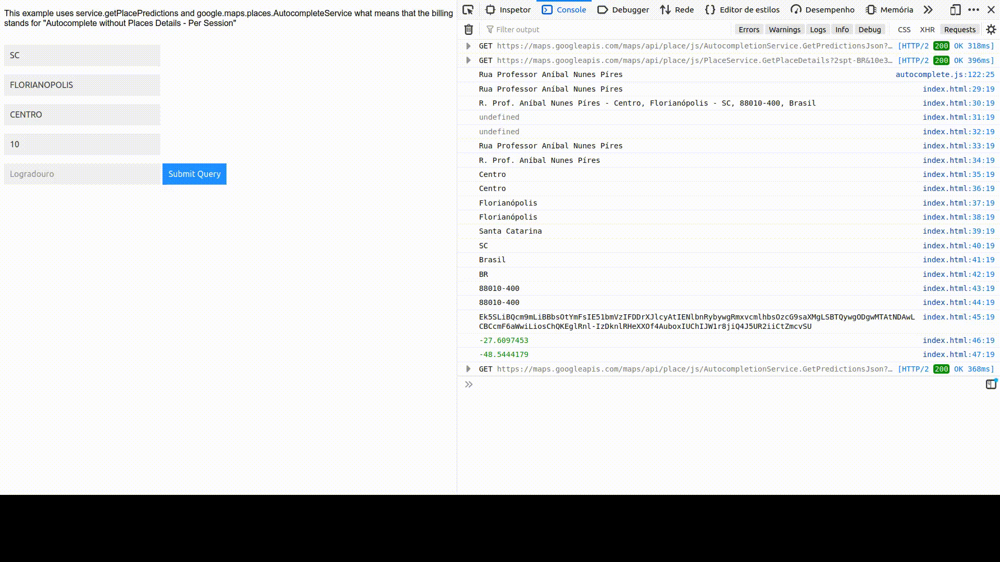

# Restricted Location Google Autocomplete

Javascript autocomplete textfield using Google Places API being capable to restrict for whatever you want.

Basically this script tricks google apis and users by adding behind the scenes the necessary restricntions within the request, before it goes to google servers.

This example uses service.getPlacePredictions and google.maps.places.AutocompleteService what means that the billing stands for "Autocomplete without Places Details - Per Session", that means you'll be billed only once since when user start typing, till he clicks on an address prediction.

Do not forget to specify your Google API Key on the example of usage "index.html".

Requires both "Maps JavaScript API" and "Places API" properly activated on your console.cloud.google.com.

The initial project was based on https://www.w3schools.com/howto/howto_js_autocomplete.asp

If you have doubts about the billing of the related requests see this explanation https://stackoverflow.com/a/53655495/4324194

# How it looks like

